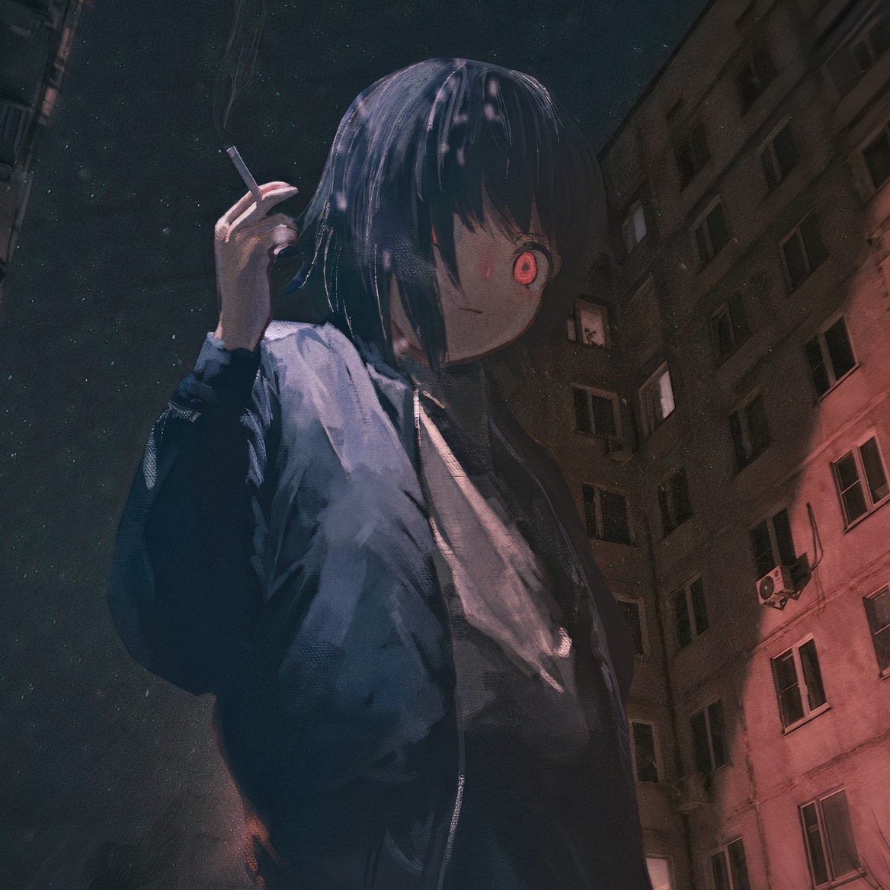

# Soul of Waifu

  
   
  <h1>Wanted an AI waifu but don't know how to create one?</h1>
  

  🤝 Now you have the opportunity to "animate" your favourite character from anime or manga. Subscribe to my youtube and telegram channels and give this project a star. Enjoy using it :3
   
  

  🤝 Теперь у тебя есть возможность "оживить" своего любимого персонажа из аниме или манги. Подпишись на мои ютуб и телеграм каналы и поставь этому проекту звезду. Насладись общением с усовершенствованным персонажем :3

 ## 🧠 Features | Функции
 - Now you can talk to your favorite character with a realistic voice.
 - This program uses TTS from ElevenLabs, and also, if necessary, you can choose SIlero TTS mode, then you can run the program without Text-To-Speech limitations locally on your computer.
 - If you're sick of texting your "AI Girlfriend", try talking with her, using voice and animations.
 - You can use any pictures of your waifu without having to make complicated models for VTube Studio.
------------------------------------------------------------------------------------------
 - Теперь ты можешь буквально поговорить со своими любимыми персонажами с Character AI на родном языке.
 - Программа использует TTS от ElevenLabs. Но, при необходимости, вы можете выбрать режим SIlero TTS, тогда вы сможете запускать программу без ограничений по Text-To-Speech локально на своём компьютере.
 - Программа автоматически переводит слова персонажа из Character AI с английского на русский, поэтому вам не нужно знать английский, чтобы общаться с любым персонажем из Character AI.
 - Если ты устал писать своей "ИИ Вайфу", тогда попробуй говорить с ней, используя реалистичный голос и анимации.
 - Ты можешь использовать изображения персонажа в полный рост, чтобы сделать PNGTuber модель.
 
 ## 👨🏻‍💻 How to run | Как запускать
 There's nothing complicated about it, just follow my instructions (Просто следуй инструкции):

 - Установи репозиторий и выполняй по очереди все требующиеся действия ниже:
 - Install the repository and follow the required steps below one by one:

📌 Requirements | Требования:
- Character AI API key, you can read about it in [here](https://pycai.gitbook.io/welcome/api/values) or [here](https://github.com/kramcat/CharacterAI/tree/main#-get-token)
- ElevenLABS API key, you can find it on their [site](https://elevenlabs.io/subscription)
- Install the CharacterAI library: `pip install characterai` After this need to launch this command: `python -m playwright install`
- Install the keyboard: `pip install keyboard`
- Install the PyTorch 2.0+: `pip3 install torch torchvision torchaudio`
- Install the sounddevice: `pip install sounddevice`
- Install the gpytranslate: `pip install gpytranslate`
- Install the Whisper Mic: `pip install whisper-mic`
- Install the ElevenLabs: `pip install elevenlabs`
- In file `soul_of_waifu` you need to paste your API keys into variables (set_api_key, client, char). Then you need to change the model in Silero TTS.
- Now you can run the `start.bat` file and enjoy the conversation.
  

-----------------------------------------------------------------------------------------
- Character AI API-ключ. Ты можешь почитать об этом [здесь](https://pycai.gitbook.io/welcome/api/values) или [здесь](https://github.com/kramcat/CharacterAI/tree/main#-get-token)
- ElevenLABS API-ключ, ты можешь найти его на их [сайте](https://elevenlabs.io/subscription)
- Установленная библиотека Character AI: `pip install characterai`. После того, как установил Character AI, введи эту команду в терминале: `python -m playwright install`
- Установленная библиотека keyboard `pip install keyboard`
- Установленная PyTorch 2.0+: `pip3 install torch torchvision torchaudio`
- Установленная sounddevice: `pip install sounddevice`
- Установленная gpytranslate: `pip install gpytranslate`
- Установленная библиотека Whisper Mic `pip install whisper-mic`
- Установленная библиотека ElevenLabs `pip install elevenlabs`
- В файле `soul_of_waifu.py` тебе необходимо вставить свои API-ключи в переменные (set_api_key, client и char). Также ты можешь поменять голоса, при необходимости.
- Теперь ты можешь запустить файл `start.bat`, выбрать необходимый режим и наслаждаться общением.

📌 Optional | Дополнительно:
- You can go [here](https://github.com/pkhungurn/talking-head-anime-3-demo) and make a character model so you can talk to her later.
- You can [download](https://olmewe.itch.io/veadotube-mini) a program to make a vtuber model for your AI character.
------------------------------------------------------------------------------------------
- С помощью [этого](https://github.com/pkhungurn/talking-head-anime-3-demo) ты можешь сделать аватар своего персонажа и разговаривать с ним.
- Ты можешь [скачать](https://olmewe.itch.io/veadotube-mini) программу, чтобы сделать PNGTuber модель для своего персонажа.

## 👀 What next? | Что дальше?

 If you have any questions, feel free to go to my discord server where myself and the server members can help you. Link: https://discord.gg/6UvYzBKCZK

 Если есть какие-нибудь вопросы, тогда переходи в мой дискорд сервер и попроси о помощи. Ссылка: https://discord.gg/6UvYzBKCZK
