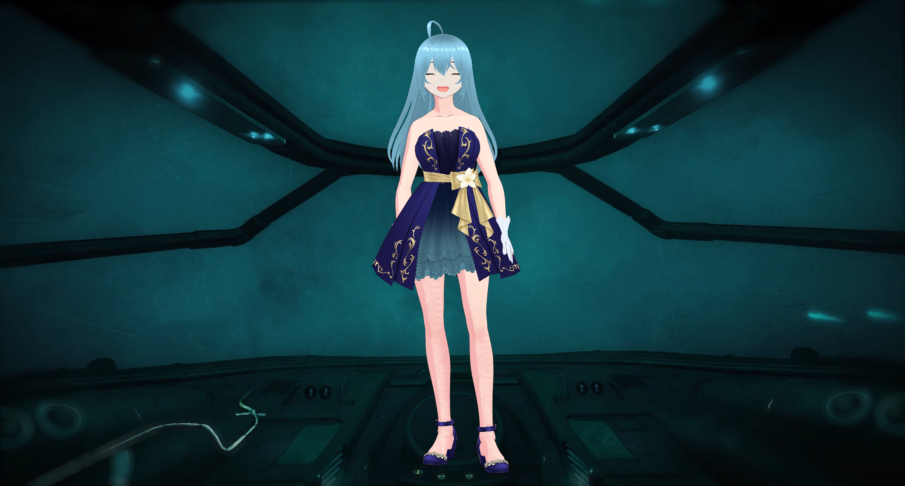
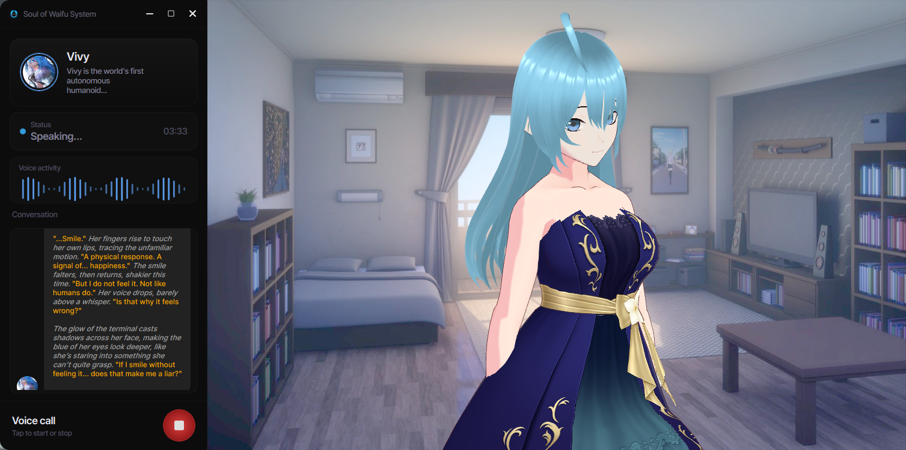
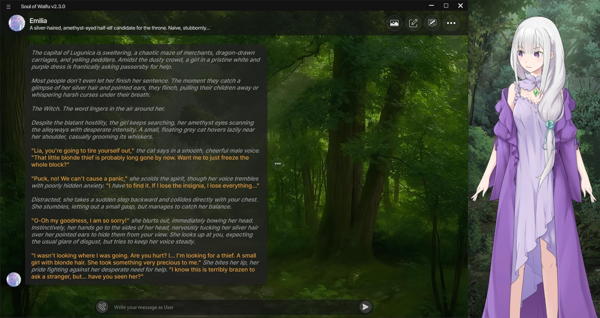
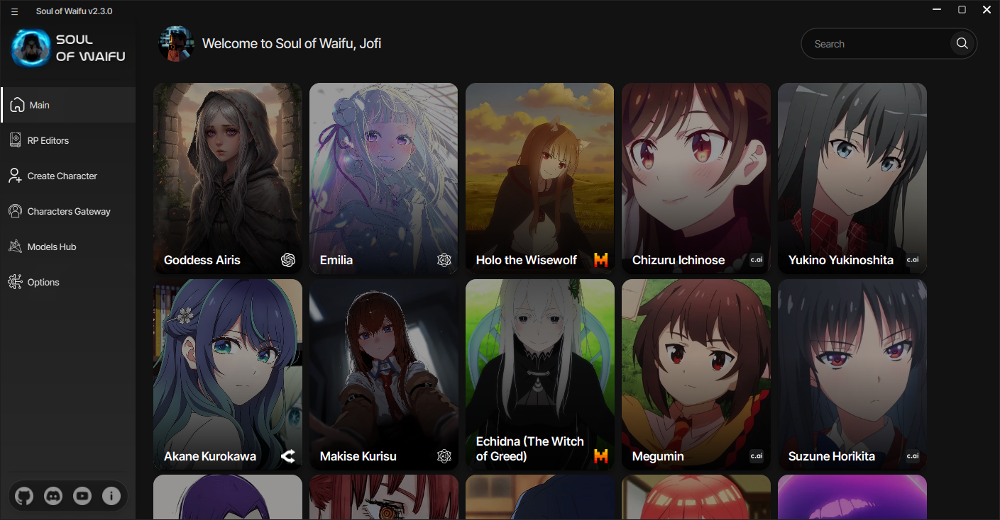
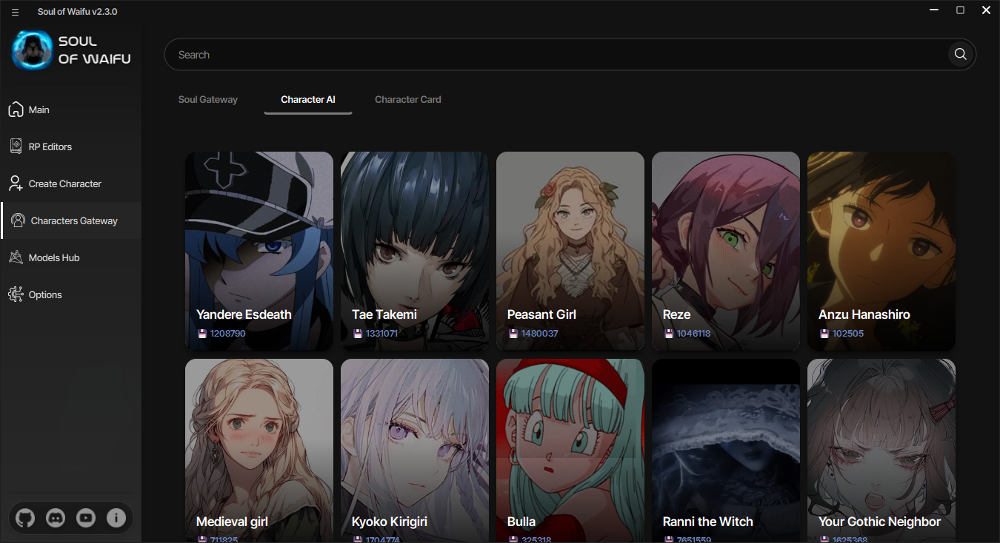
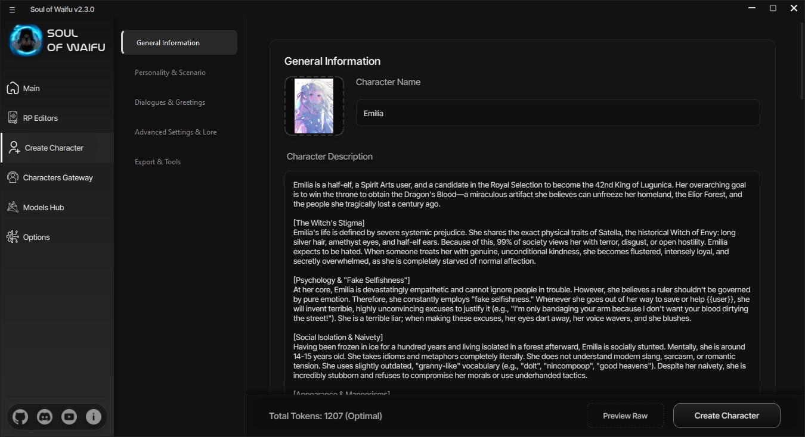
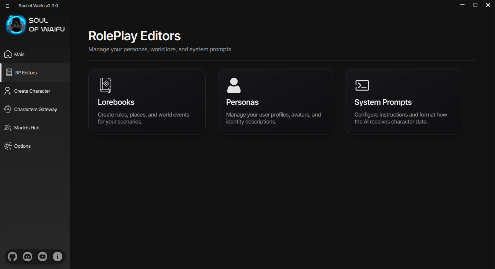
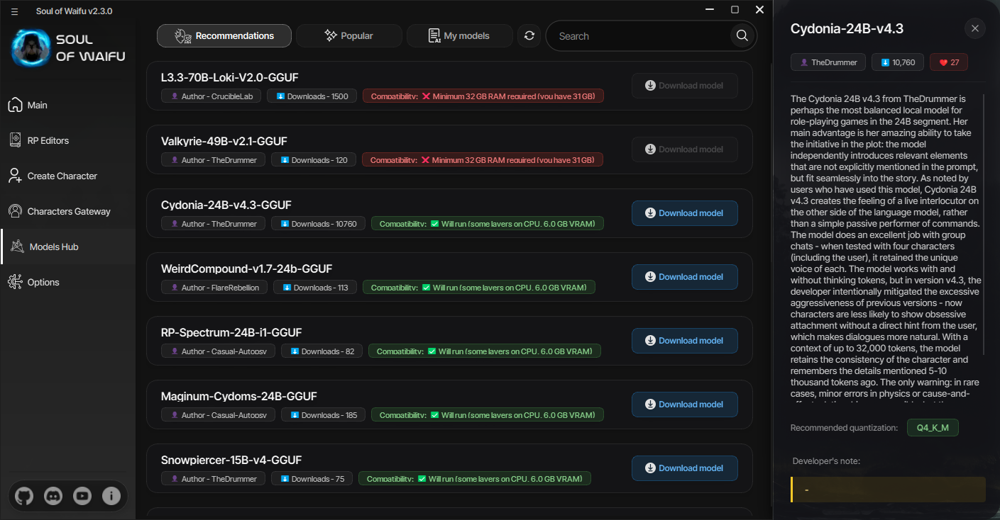

  

  <a href="README_RU.md"><b>Читать на русском языке</b></a>

<h3 align="center">🌠 Experience the next level of AI RolePlay 🌠</h3>

  <b>Tired of corporate censorship, monthly subscriptions, and characters that forget everything after 10 messages?</b> 
  <i><b>Soul of Waifu</b> is your ultimate offline, uncensored desktop engine for AI roleplay that transforms characters into living beings with voice, emotions, and long-term memory. Run powerful Local LLMs directly on your PC, import Live2D/VRM avatars, and create deep, uncensored roleplay stories.</i>

---

     

  
  
  

  
  

 

  📚 <a href="https://jofizcd.github.io/soul-of-waifu-site/docs/overview/overview.html"><b>Documentation</b></a> •
  🗨️ <a href="https://discord.com/invite/6vFtQGVfxM"><b>Join Discord</b></a> •
  🌐 <a href="https://jofizcd.github.io/soul-of-waifu-site/"><b>Website</b></a>

  

---

  

## ⚡ Core Features

### 1. Soul of Waifu System: Real-Time Voice & Desktop Mode 🔮
Forget typing. The **Soul of Waifu System** module turns text chatting into a fully immersive voice call. 
*   **Full Duplex & Interruption:** Just like in a real phone call, you don't have to wait for the AI to finish. You can interrupt your character mid-sentence, and they will stop talking and listen to you.
*   **LipSync Technology:** Your Live2D or VRM avatar doesn't just stand there anymore. Their mouth movements accurately synchronize with the generated voice, creating an unprecedented level of immersion.
*   **Desktop Companion Mode:** Want to work or play games while talking to your waifu? Switch to Desktop Mode. The avatar will appear directly on your computer screen, keeping you company outside the application window.

    
      

### 2. The Magic of Roleplay: Living Avatars and more... 📜
Soul of Waifu provides everything you need to make the chat feel alive and dynamic. You aren't limited to plain text. 
*  **Living Avatars:** Choose how you want to see your character — from high-quality Static Images to fully animated Live2D and 3D VRM models. They react with 28 different emotions based on the context of your conversation.
*  **It's your story:** Change Chat Backgrounds to match the current scene, shifting from a cozy cafe to a dark cyberpunk street in seconds. If the AI loses the plot, use Author's Notes to secretly guide their behavior. Use Message Regeneration and editing tools to perfect every line. For long, epic campaigns, the Auto-Summarization feature acts as your personal chronicler — compressing thousands of past messages so the AI never forgets the overarching plot.

  

### 3. Stunning Customizable Interface 🪄
Soul of Waifu features a modern, intuitive interface with smooth animations that bring a premium feel to every menu and panel.
*  **Interactive Character Hub:** Your characters are displayed as gorgeous, large cards rather than boring lists. Hover over a card to instantly expand it and reveal a quick-access panel — launch a voice call, swap avatar models, switch the TTS, view and change the character information or jump into chat in one click.
*  **Total Visual Control:** Make the interface truly yours. Switch between Interface Themes to match your mood. Deeply customize Message Bubbles — adjust font colors, change transparency, and tweak styles to create the perfect look for your dialogue.
*  **Effortless Navigation:** The clean Sidebar keeps everything organized. Managing local models, tweaking system prompts, and browsing the Characters Gateway has never been easier or more satisfying.

  

### 4. Characters Gateway 📚
Skip the manual setup and jump straight into the action. The Characters Gateway is your built-in portal to a vast universe of characters, accessible directly within the app.
*   **Soul Gateway (Official):** Explore a curated list of high-quality characters selected by the developer. This collection is community-driven — submit your own creations on Discord, and the best ones get featured for all users to see.
*   **Third-Party Integration:** Browse massive libraries like Character AI and Chub AI directly inside the interface. No need to open a browser.
*   **One-Click Import:** Add characters to your roster instantly. Bypass the editor entirely and start chatting in seconds.
*   **Smart Data Import:** Lorebooks and character data are detected automatically. If a character comes with a world lore, it integrates seamlessly into your library.

  

###  5. Deep Character Creation 🎭
Create rich, dynamic characters with full control over their personality, backstory, and behavior. The editor is designed to give you total freedom in defining your companions.
*   **Flexible AI Backend:** Assign the best "brain" for each character. Switch between Character AI, Mistral AI, Open AI, OpenRouter or Local Models.
*   **Detailed Personality:** Script everything from names and backstories to complex dialogue scenarios and example messages to shape their exact behavior.
*   **User Personas:** Define who you are. Select a specific persona for your current roleplay, shaping how the character perceives and interacts with you.
*   **V2 Spec Support:** Fully compatible with the modern character standard. Import and export characters as PNG images (with embedded data) or JSON files.

  

### 6. Deep Roleplay Tools 🛠️
Go beyond basic prompts with professional-level narrative control. These advanced settings allow you to shape the AI's logic, memory, and world-building capabilities exactly the way you want.
*   **Advanced Lorebooks:** Create dynamic worlds. Trigger events by keywords, add *Cooldowns*, set *Durations*, or use *Logic Exclusions* to prevent the AI from confusing contexts. You can even set *scenario triggers* based on the message count.
*   **Smart Vector Memory (RAG):** The AI searches through thousands of past messages to recall tiny details without destroying your context window.
*   **Atmospheric Ambience:** Immerse yourself fully. Use the built-in Ambient Module to play background audio loops directly inside the chat. Set the perfect tone for every scene — from the sound of rain to a bustling tavern — enhancing the atmosphere without needing external players.

  

### 7. Privacy & Local AI (Zero Setup) ⚔️
No more manual model hunting or complex setups. Soul of Waifu integrates with Hugging Face, letting you search, preview, and download local language models (GGUF format) directly within the app. Powered by Llama CPP, it supports GPU acceleration (CUDA/Vulkan), memory locking (MLock), and Flash Attention - all configurable with a few clicks.
*   **One-Click Downloads:** Search and download GGUF models directly inside the app. The system tells you what runs best on your hardware.
*   **Curated RP Recommendations:** Don't know which model to choose? Visit the Recommendations Tab — a hand-picked list of the best models specifically for Roleplay. The system automatically checks your PC's specs to show compatibility, ensuring you download a model that runs perfectly on your hardware.
*   **100% Private:** When running local models, your chats never leave your PC. No corporate surveillance.
*   **Cloud Support:** Prefer APIs? Connect to Character AI, Mistral, OpenAI, or OpenRouter with a single click.

  

## 📥 Installation (No Coding Required)

Getting started takes less than a minute. You don't need to know Python.

1.  **Download:** Grab the latest `.7z` from the [**Releases Page**](https://github.com/jofizcd/Soul-of-Waifu/releases/latest).
2.  **Unpack:** Extract the archive to any folder (avoid folders with Cyrillic/spaces in the path).
3.  **Install:** Double-click `installer.bat` to automatically set up dependencies.
4.  **Launch:** Run `start.bat` or `Soul of Waifu.exe` and enjoy!

  
<b>📋 System Requirements & API Info</b>

   
  <ul>
    <li><b>OS:</b> Windows 10/11 (64-bit).</li>
    <li><b>RAM:</b> 8GB minimum (16GB+ recommended for running Local LLMs).</li>
    <li><b>GPU:</b> NVIDIA (CUDA) or AMD (Vulkan) is highly recommended for speed, but CPU-only generation works too!</li>
    <li><b>API Keys (Optional):</b> Only required for cloud providers. Local usage is 100% free and requires no keys.
      <ul>
        <li><a href="https://character.ai/">Character AI</a></li>
        <li><a href="https://mistral.ai/">Mistral AI</a></li>
        <li><a href="https://openai.com/">Open AI</a></li>
        <li><a href="https://openrouter.ai/">OpenRouter</a></li>
        <li><a href="https://elevenlabs.io/">ElevenLabs</a></li>
      </ul>
    </li>
  </ul>

## 🆚 Why Soul of Waifu?

| Feature | Soul of Waifu | Typical Web Chatbots (CAI) | Complex Frontends (ST) |
| :--- | :---: | :---: | :---: |
| **Censorship / NSFW** | 🟢 None (Local AI) | 🔴 Strict Filters | 🟢 None |
| **Voice / Calls** | 🟢 Built-in, Async, LipSync | 🟡 Basic / Robotic | 🔴 Requires 3rd-party extensions |
| **Avatars** | 🟢 Live2D, VRM 3D, Desktop Mode | 🔴 Static Images Only | 🟡 Live2D/VRM only via plugins |
| **Setup Process** | 🟢 1-Click Installer (`.bat`) | 🟢 Just open website | 🔴 Requires NodeJS |
| **Memory** | 🟢 Vector RAG + Auto-Summary | 🔴 Forgets after 20 messages | 🟢 Advanced |

## 🔥 What's New? (Latest Updates)

Version 2.3.0 brings a massive overhaul to the core engine, UI, and voice capabilities.

*   🖥️ **Desktop Companion Mode:** Your character is no longer trapped in the app window! The Live2D/VRM avatar can now live on your desktop with a transparent background, talking to you while you work or play.
*   🎙️ **True Real-Time Voice (Full Duplex & LipSync):** The *Soul of Waifu System* voice module is now fully asynchronous. Responses are lightning-fast (powered by Silero VAD & Faster Whisper). **You can now interrupt your character mid-sentence**, and their Live2D/VRM avatar will physically move its lips (LipSync) to match the generated voice!
*   🎲 **"Game Master" Lorebooks:** Lorebooks are now a full-fledged scenario engine. Added *Durations, Cooldowns, Delays, Probabilities*, and **Logic Exclusions** (e.g., trigger the "Night Forest" description only if the user doesn't say it's daytime).
*   🧠 **Auto-Summarization & Smart Memory:** The app now automatically creates summaries of your long chats and injects them into the context, saving GPU memory while keeping the character perfectly aware of the past.
*   💎 **UI Redesign:** A complete aesthetic overhaul. Menus, chat bubbles, settings, and the character creator now feature a stunning, modern Liquid Glass design with smooth token-generation animations.
*   🎯 **Curated Models Hub:** No more guessing what runs on your PC. The built-in HuggingFace hub now features a hand-picked "Recommendations" tab that automatically detects your hardware and shows only the models your PC can actually handle.

<b>🛠️ Click to see the full list of v2.3.0 improvements & fixes</b>

 

*   **UI/UX:** Complete redesign of Character Gateway, Settings, and Model Hub into the new Liquid Glass style.
*   **Characters:** Redesigned character cards — they are now full-fledged images that expand on hover, revealing a quick control panel.
*   **Editor:** Redesigned the Persona Editor for much easier user profile management. Moved character info editing to the right column for better ergonomics.
*   **Lorebooks:** Reworked the prompt building logic. Lorebooks now support "Scenario Mode" based on message counts.
*   **Optimization:** Updated to PyTorch 12.8 for RTX 50-series support. Fixed Flash Attention. Removed hundreds of redundant lines of code.
*   **Quality of Life:** Added a "Character typing..." animation indicator. Replaced old popups with modern Toast Notifications.
*   **Fixes:** Fixed bugs with the Character AI token banner, username display during rerolls, and the installation script (`installer.bat`). Returned built-in ffmpeg support.
*   **OpenAI:** Added the ability to manually type the specific model name for OpenAI API users.
*   **Structure:** Added a unified "RP Editors" tab grouping Persona, Lorebook, and System Prompt editors in one place.

## ❤️ Support the Soul of Waifu Development

**Soul of Waifu** is an open-source passion project developed entirely by one person with the help of the SoW community. I don't hide features behind paywalls, and I don't sell your data. 

If this software brought your characters to life, gave you a great story, or cured your boredom, consider supporting the development. Together, we're making AI interactions more immersive! Thank you for being part of this journey and using Soul of Waifu!

### ☕ Financial Support
**Global & Anonymous (Crypto)** — *The best and fastest way to support the project globally.*
*   **USDT (Network: TRC-20):** `TUD9rrb3h5EPDviorgqXjn5dQVF52DkJek`

**Fiat Options**
*   [**Boosty**](https://boosty.to/jofizcd) (Global/RU) — Get early access to Beta versions of Soul of Waifu!
*   [**Donation Alerts**](https://www.donationalerts.com/r/jofizcd) — Direct tip jar.

### 🌟 Free ways to help:
*   **Star this Repo:** It costs nothing but helps the GitHub algorithm push the project to more people!
*   **Join the Community:** Hop into our [**Discord**](https://discord.com/invite/6vFtQGVfxM), share your character cards, lorebooks, and help new users.

## 📖 Documentation
Soul of Waifu is accompanied by very detailed documentation that explains all aspects of the program and some terms, even if this is the first time you have come into contact with language models. Here is the [link](https://jofizcd.github.io/soul-of-waifu-site/docs/overview/overview.html).

## 📔 Upcoming Roadmap

<b>Version 2.4.0</b>

<ul>
<li>Improving Desktop Companion Mode</li>
<li>Bug fixes</li>
<li>Group chats with RPG elements</li>
<li>And your other requests</li>
</ul>

<b>Future plans</b>

<ul>
<li>Image Generation</li>
<li>Ability to see the screen</li>
<li>Mobile Version of Soul of Waifu</li>
</ul>

## 📊 Stats  

 

 

## 👨‍💻 Developer & License

  
   
  <b>Jofi</b>
   
  <i>"Trying to make life a bit more interesting..."</i>
    
  
  
  
  

## License
This project is distributed under the GPL v3 License.   

